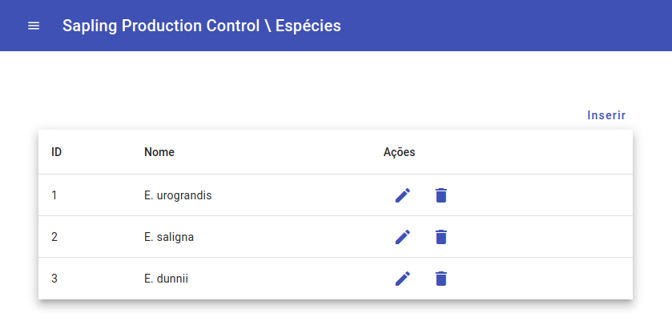
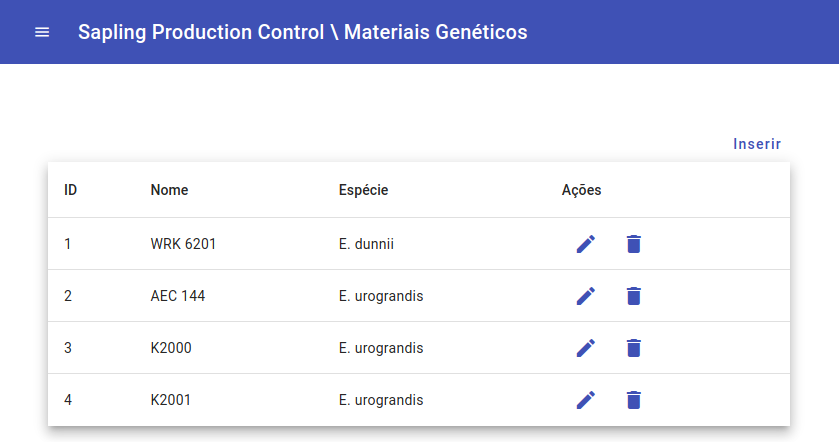
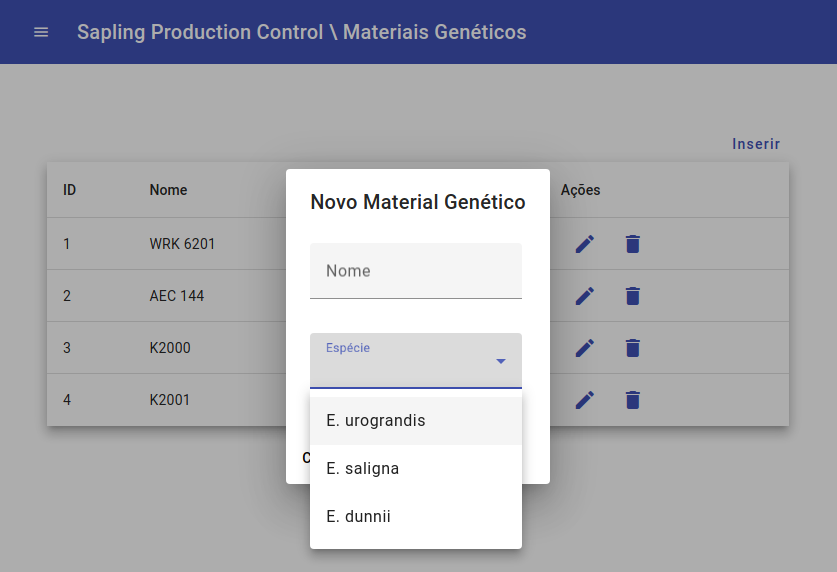

# Trabalho Final do Módulo de Angular na Turma de Java do Programa +Devs2Blu

Este projeto foi desenvolvido por mim usando [Angular CLI](https://github.com/angular/angular-cli) versão 16.2.5.

Ele implementa um frontend para a Api [Sapling Production Control](https://github.com/regis-amaral/Sapling-Production-Control).

Na versão atual apenas duas entidades são gerenciadas:
- Espécies
- Materiais Genéticos

## Execução do projeto

Na linha de comando, execute `npm install` para instalar as dependências. 

Após a instalação das dependências e com o projeto da API [Sapling Production Control](https://github.com/regis-amaral/Sapling-Production-Control) rodando, execute `ng serve` para executar este projeto. 

No navegador, abra o endereço `http://localhost:4200/` para acessar a página do projeto.

## Tela de Gerenciamento de Espécies

## Tela de Gerenciamento de Materiais Genéticos

## Modal para inserção/edição de um Material Genético

## Considerações 

O desenvolvimento deste projeto utilizando Angular representou uma experiência valiosa e enriquecedora para mim, proporcionando um mergulho profundo em um framework com o qual eu não tinha familiaridade anteriormente. Ao longo das aulas e práticas, pude perceber que o Angular se destaca como um framework de excelência.

Embora exija a criação de diversos arquivos e código para cada funcionalidade, vejo isso como uma prática fundamental para manter uma arquitetura bem estruturada. A abordagem de dividir o sistema em partes menores facilita significativamente futuras manutenções e modificações. Esta metodologia não apenas simplifica o processo de desenvolvimento, mas também oferece uma base sólida para um crescimento seguro e sustentável.

Além disso, a organização e padronização que o Angular proporciona são cruciais para a compreensão e colaboração em projetos de equipe. A estrutura clara e as convenções bem definidas tornam o código mais legível e fácil de dar manutenção.

Destaco ainda a capacidade do Angular de promover a reutilização de componentes e serviços, o que contribui para uma abordagem mais eficiente no desenvolvimento de aplicações complexas.

Esta experiência me deixou ainda mais motivado a explorar ainda mais a fundo as possibilidades que o Angular oferece e a aplicar esse aprendizado em projetos futuros.

Agradeço a professora [Maju Testoni](https://github.com/majutestoni) que ministrou o módulo com excelência e me orientou no desenvolvimento do projeto.
